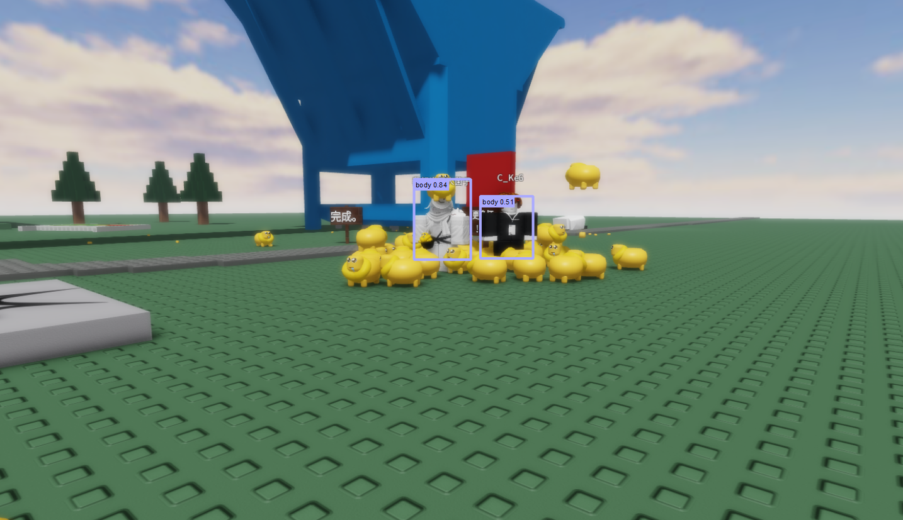
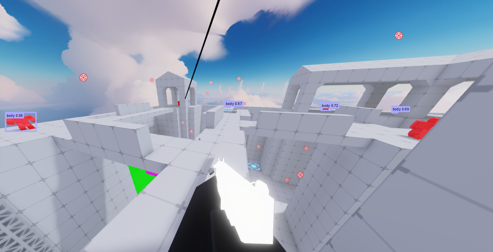
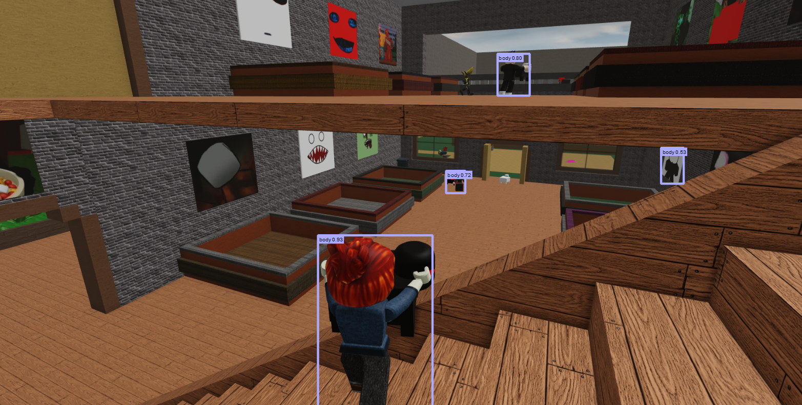
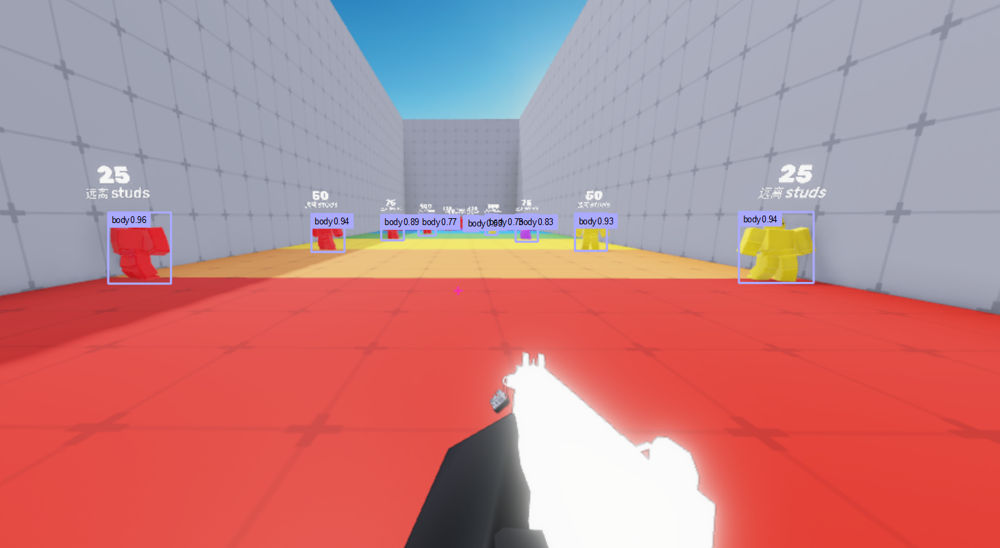

# Roblox_Aimbot_YOLOv5
A Roblox game character detection model based on YOLOv5
# Because of the diversity of Roblox games and clothing, this model is difficult to fully adapt to all games, and it is inevitable that there will be some missed detections and false detections.
# Due to my lack of computing power, this may be the final version of the model, and later a 'small' version of the model will be trained based on the original dataset.

